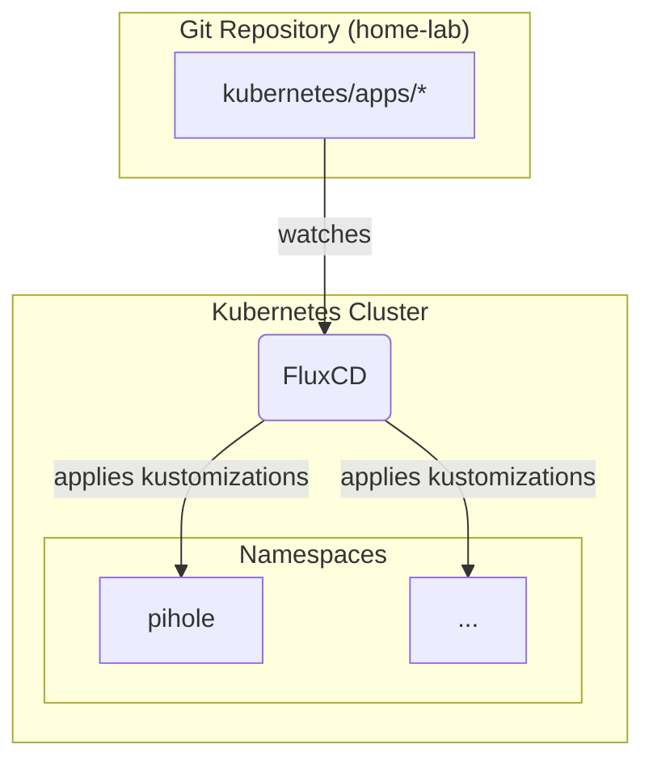

# Home Lab

My home lab configuration consumed by Flux

## Overview

This repository contains the Kubernetes manifests for my home lab, managed declaratively with GitOps using [Flux](https://fluxcd.io/).

### Architecture

The diagram below illustrates the GitOps workflow for this cluster. Flux monitors this repository and automatically applies any changes to the Kubernetes cluster. Applications are organized by namespace within the `kubernetes/apps` directory.

